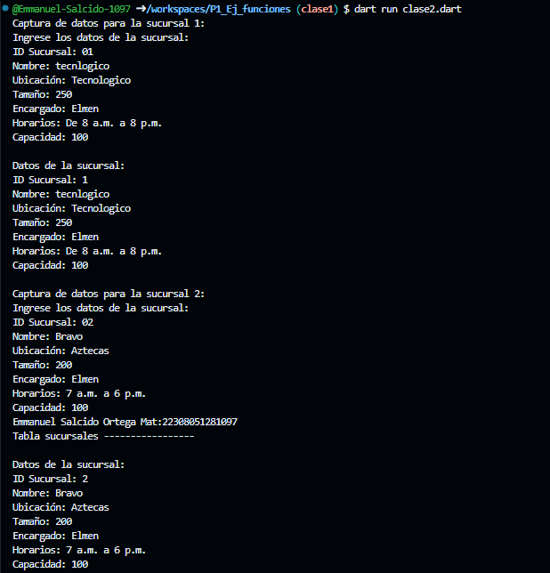
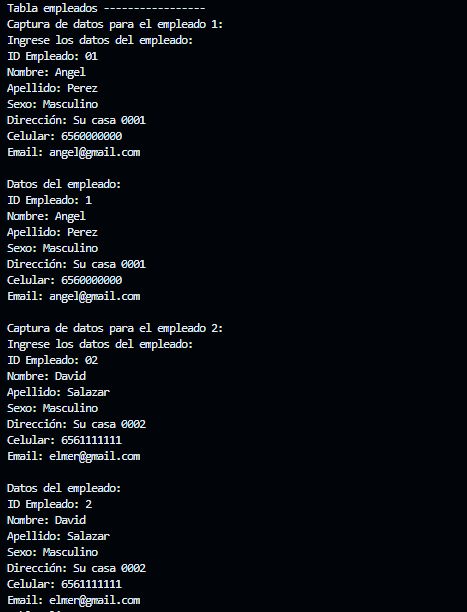
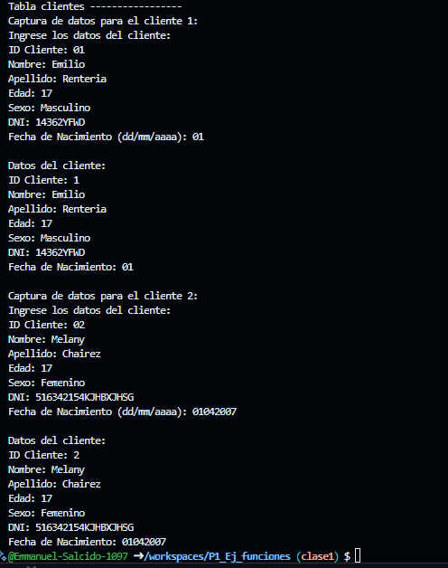

1-crear una clase Sucursales con 7 atributos (Id_Sucursal, Nombre, Ubicacion, Tamaño, Encargado, Horarios, Capacidad), una función captura() desde la interfaz y otra mostrar datos(), crear instancia y utilizarlos atributos y llamadas a las funciones lenguaje Dart

2-crear una clase Empleados con 7 atributos (Id_Empleado, Nombre, Apellido, Sexo, Direccion, Celular, email), una función captura() desde la interfaz y otra mostrar datos(), crear instancia y utilizarlos atributos y llamadas a las funciones lenguaje Dart

3-crear una clase Clientes con 7 atributos (Id_Cliente, Nombre, Apellido, Edad, Sexo, DNI, fecha_nacimiento), una función captura() desde la interfaz y otra mostrar datos(), crear instancia y utilizarlos atributos y llamadas a las funciones lenguaje Dart

