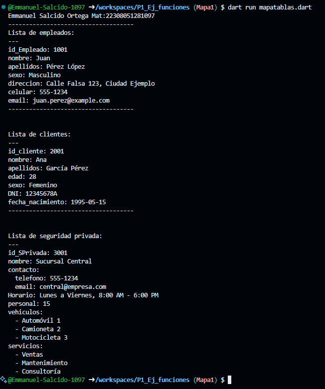

Crear map <String, dynamic> Empleado con los siguientes key, id_Empleado, nombre, apellidos, sexo, direccion, celular, email. Y mostrar los datos con un forEach. Lenguaje dart

Crear map <String, dynamic> Clientes con los siguientes key, id_cliente, nombre, apellidos, edad, sexo, DNI, fecha_nacimiento. Y mostrar los datos con un forEach. Lenguaje dart

Crear map <String, dynamic> Seguridad Privada con los siguientes key, id_SPrivada, nombre, contacto, Horario, personal, vehiculos, servicios. Y mostrar los datos con un forEach. Lenguaje dart

